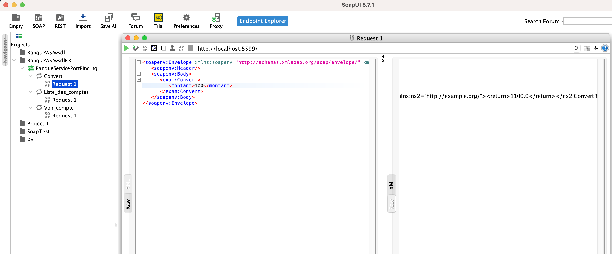
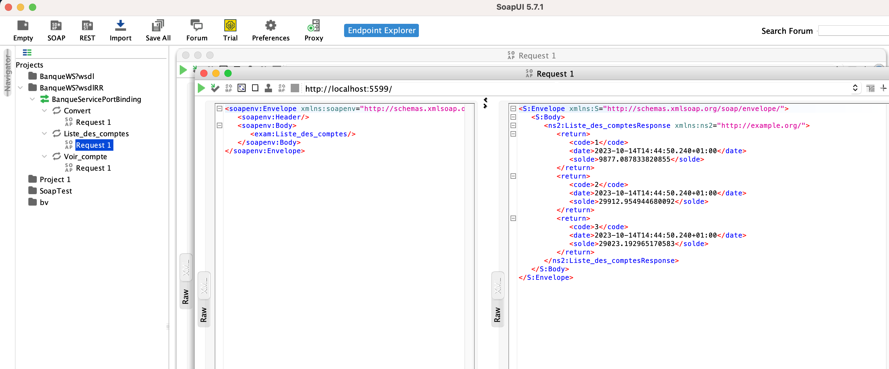
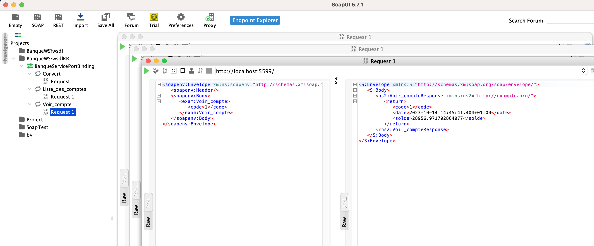

 
Welcome to the "web-service-SOAP" project, a SOAP web service that provides several methods for different operations.

    <h2>Screenshots</h2>
    
    
Here are some screenshots demonstrating the SOAP methods:

    
    

        <h3>Convert Method</h3>
        
The "Convert" method takes a "montant" as input and returns the result of multiplying it by 11.

        
    

    
    

        <h3>Voir_compte Method</h3>
        
The "Voir_compte" method accepts a "code" as input and returns a randomly generated "Compte" object.

        
    

    
    

        <h3>Liste_des_comptes Method</h3>
        
The "Liste_des_comptes" method retrieves a list of randomly generated "Compte" objects.

        
    

    
    <h2>Usage</h2>
    
    
For information on how to use these SOAP methods in your application, please refer to the documentation or user guide.

    
    <h2>Contributing</h2>
    
    
If you'd like to contribute to this project, please follow the guidelines outlined in the project's contribution guidelines.

    
    <h2>License</h2>